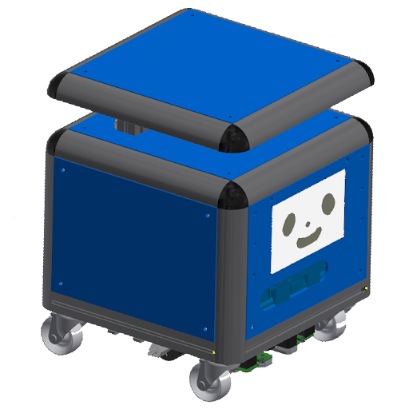
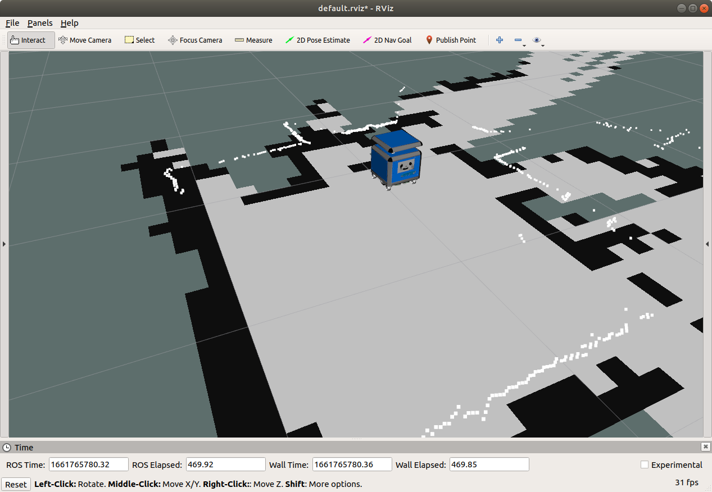
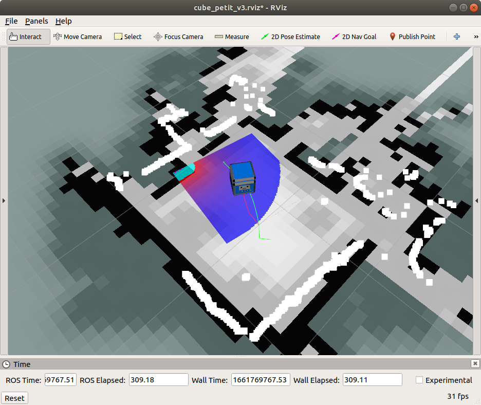
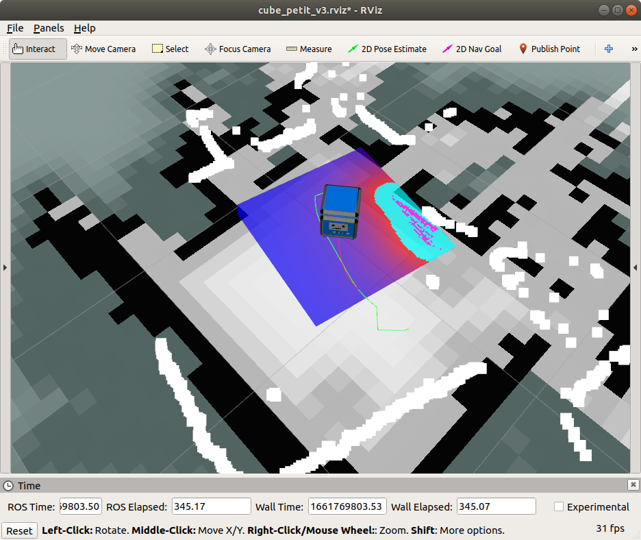
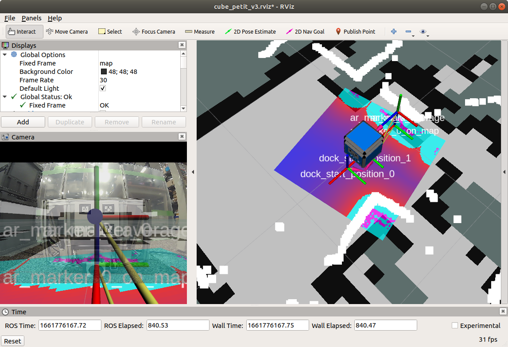
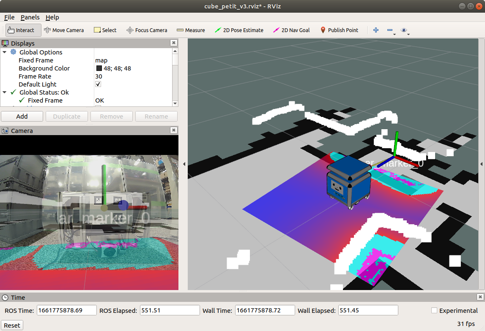
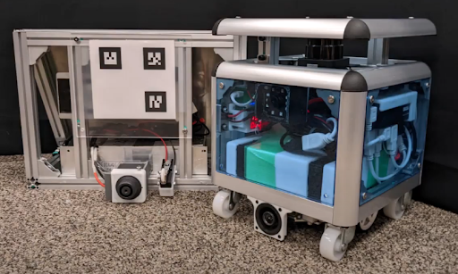
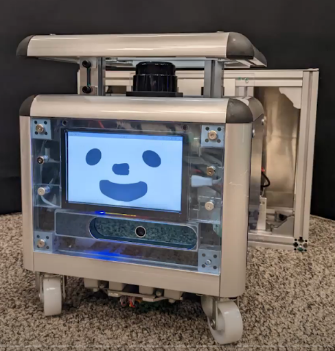

# cube_petit_ros



Cube petit(キューブプチ)は人の生活に入り込むことの出来る自律走行ロボットです
世の中に普及させるため低価格で小型なロボットキットを目指して開発しています

ハードウェアは既製品の組み合わせで構成しているのでお好きなセンサーやモーターを取り付けられます。ソフトウェアはオープンソースのROSに対応しており、自由にカスタマイズが可能です

Cube petit is a desktop-sized Cuboid-kun that is intended to be sold
at low cost and widely distributed around the world.

Cube petit was born to coexist in people's living spaces,
serve many people, and make many people smile.

Cube petit is self-driving and can be charged by itself.
There are ivory, clear blue, and yellow color variations.

Cube petitの動画は[Youtube](https://youtube.com/playlist?list=PL509ZQjTHPYecUfyNaroISz6ZV1QCh2k4)でご確認ください<br>展示会など最新の出展情報は[Twitter @Cube_petit_2022](https://twitter.com/Cube_petit_2022)でご確認ください

本リポジトリでは<br>SLAM(地図作成と自己位置推定)、自律移動、および自動充電をシミュレータで体験できます

---

## Repositories

* [cube_petit](https://github.com/sbgisen/cube_petit): More about Cube petit & DIY Kit
* [cube_petit_cad](https://github.com/sbgisen/cube_petit_cad): Cube petit's CAD
* [cube_petit_ros](https://github.com/sbgisen/cube_petit_ros): This Repository


---

## Contents

1. Function
1. Packages
1. PC/Sensors
1. Introduction
1. Quick Usage


## 1. Function
### 1-1. Basic Function: Mapping and Navigation
**2D LiDAR**を使用して自己位置推定、地図作成をします<br>さらに**Depth Camera**で人や障害物を避けながら指定した位置まで移動・巡回します<br>**ROS package**(**gmapping**, **navigation**)を使用しています



### 1-2. Advanced Function: Auto Charging
**Battery**が減ったことを検知し充電ドックに移動します<br>ARマーカーを見ながら自動で充電します<br>**ROS package**(**ar_track_alvar**)を使用しています




### 1-3. Advanced Function: Offline Conversation

オフラインの音声合成と音声認識に対応しています<br>対応言語は日本語とEnglighです<br>日本語の音声合成に**OpenJTalk**、認識に**Julius**を使用しています<br>感情や速度を変えながら話せます<br>


---

## 2. Packages

1. cube_petit_ros
2. cube_petit_ar_docking (auto charging)
3. cube_petit_bringup
4. cube_petit_description (urdf/xacro)
5. cube_petit_gazebo
6. cube_petit_hardware_interface (motor)
7. cube_petit_navigation
8. jbd_battery_monitor (battery monitor)
9. navigation_goals
10. cube_petit_text_to_speech
11. cube_petit_speech_to_text

## 3. PC/Sensors

- Ubuntu18.04 / ROS1 (Melodic) -> **Version 2**
- Ubuntu20.04 / ROS1 (Noetic) -> **Version 3**
- LiDAR (LDS-50C)
- Depth Camera (Intel RealSense Depth Camera SR305)
- Infrared Camera (ELP-USBFHD01M-KRL156)
- Air pressure meter and 9-axis IMU (Witmotion wt901b)

## 4. Introduction
### 4-1. Cube petit (Real robot, Ubuntu18,20)
```
cd ~/catkin_ws/src
git clone git@github.com:AiriYokochi/setup_cube_petit.git
cd cube_petit_setup
source setup.bash
```

### 4-2. Other PC (Ubuntu16,18,20)

```
cd ~/catkin_ws/src
git clone git@github.com:sbgisen/cube_petit_ros.git
cd cube_petit_ros/cube_petit_ros
catkin bt
source ~/catkin_ws/devel/setup.bash
```
## 5. Quick Usage

### 5-1. bringup
On real robot
```
roslaunch cube_petit_bringup cube_petit_bringup.launch
```

On Gazebo9
```
roslaunch cube_petit_gazebo cube_petit_gazebo_pc.launch
```
### 5-2. SLAM

```
roslaunch cube_petit_navigation cube_petit_gmapping.launch
```

### 5-3. navigation

```
roslaunch cube_petit_navigation cube_petit_naviagation.launch
```

---

## Author

* Airi Yokochi
* Softbank corp.
* airi.yokochi@g.softbank.co.jp

## Licence

* Apache License Version 2.0
* See [LICENSE](LICENSE)
