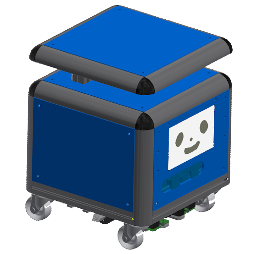
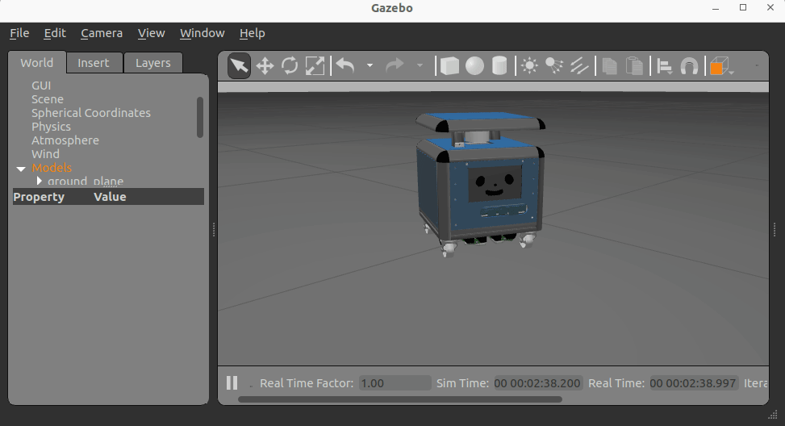

# cube_petit_ros



Cube petit(キューブプチ)は人の生活に入り込むことの出来る自律走行ロボットです
世の中に普及させるため低価格で小型なロボットキットを目指して開発しています

ハードウェアは既製品の組み合わせで構成しているのでお好きなセンサーやモーターを取り付けられます。ソフトウェアはオープンソースのROSに対応しており、自由にカスタマイズが可能です

Cube petit is a desktop-sized Cuboid-kun that is intended to be sold
at low cost and widely distributed around the world.

Cube petit was born to coexist in people's living spaces,
serve many people, and make many people smile.

Cube petit is self-driving and can be charged by itself.
There are ivory, clear blue, and yellow color variations.

Cube petitの動画は[Youtube](https://youtube.com/playlist?list=PL509ZQjTHPYecUfyNaroISz6ZV1QCh2k4)でご確認ください<br>展示会など最新の出展情報は[Twitter @Cube_petit_2022](https://twitter.com/Cube_petit_2022)でご確認ください

本リポジトリでは<br>本体のセットアップおよびGazeboシミュレータでteleopや会話(音声合成・音声認識)ができます。
※現在音声合成機能はgithubでsbgisenのグループに入っている必要があります。

---

## Repositories

* [cube_petit](https://github.com/sbgisen/cube_petit): More about Cube petit & DIY Kit
* [cube_petit_cad](https://github.com/sbgisen/cube_petit_cad): Cube petit's CAD
* [cube_petit_ros](https://github.com/sbgisen/cube_petit_ros): This Repository


## Quick Install

```
cd ~/ros/src/
git clone -b feature/humble_setup git@github.com:sbgisen/cube_petit_ros.git
wstool merge cube_petit_ros/.rosinstall
wstool up
rosdep install -r -y -i --from-paths src
cd ~/ros && colcon build --symlink-install --packages-up-to cube_petit_ros
source install/setup.bash
```

## Launch Gazebo
```
ros2 launch cube_petit_gazebo cube_petit_gazebo.launch.py
```

「起動しました！」の声と同時にGazeboが起動します。
PS4コントローラをPCに接続してXボタンを押しながらスティックを移動させると動きます。
マイクを接続して「キューブプチ」と発話すると「はーい」と返事します。

As soon as you hear "Kidou shimashita!", Gazebo will launch.
When you connect the PS4 controller to your PC, pressing the X button and moving the stick will make it move.
If you connect a microphone and say "Cube Petit", it will respond with "Yes"




## 1. Contents(ROS2-humble)

- [x] bringup motor
- [x] bringup lidar
- [x] bringup ai-kamera
- [x] teleop
- [x] gazebo
- [x] text_to_speech(Japanese)
- [x] speech_to_text(Japanese)
- [x] Python API (text_to_speech)
- [x] Python API (chat gpt chat)
- [x] Python API (chat gpt chat using image)
- [ ] bringup realsense[TODO]
- [ ] gmapping[TODO]
- [ ] navigation[TODO]

---

## 2. Packages

- `cube_petit_ros`: メタパッケージ
- `cube_petit_description`: Cube_petitのxacroファイル
- `cube_petit_gazebo`: Gazebo(シミュレーション)
- `cube_petit_speech_to_text`: Juliusを用いた音声認識、ホットワード
- `cube_petit_text_to_speech`: open-jtalkを用いた音声合成
- `cube_petit_python_api`: PythonAPI(発話、ChatGPTを用いた会話)
- `cube_petit_bringup`: 実機の起動
- `cube_petit_facial_animation`: 実機の顔のアニメーション
- `cube_petit_hardware_interface`: 実機のモータ起動

## 3. PC/Sensors

- Ubuntu22.04LTS
- Sensors
    - 2D LiDAR
    - (Optional) Depth Camera
    - (Optional) AI Camera
- Microphone
- Speaker

## 4. Another Package 

- [cube_petit_smach_ros](git@github.com:sbgisen/cube_petit_smach_ros.git)
    - `smach_ros`を用いたステートマシンパッケージです
    ```
    cd ~/ros/src
    git clone -b feature/add_state_machine git@github.com:sbgisen/cube_petit_smach_ros.git
    cd ~/ros/
    rosdep install --from-paths src --ignore-src -r -y
    cd ~/ros && colcon build --symlink-install --packages-up-to cube_petit_smach_ros
    source install/setup.bash
    ```


---

## Author

* Airi Yokochi
* Softbank corp.
* airi.yokochi@g.softbank.co.jp

## Licence

* Apache License Version 2.0
* See [LICENSE](LICENSE)
